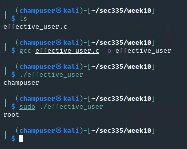

# Linux - Permission Vulnerabilities

| 💡The following 'C' program prints out the "effective user name" of the running process as opposed to the user who invoked that process. So if bob runs this program, bob would be printed out. If it is run as sudo, root would be printed out. If the suid bit is set, the owner of the file will be the effective user. So if root owns the file and bob runs it, the effective user will be root. |
| :----------------------------------------------------------: |

```
#include <stdlib.h>
#include <pwd.h>
#include <stdio.h>
#include <unistd.h>

/*
SEC335 Illustrate SUID Programs
* based on: https://stackoverflow.com/questions/8953424/how-to-get-the-username-in-c-c-in-linux
* Make sure run the following
* sudo chown root:root nameofprogram
* sudo chmod u+s nameofprogram
*/

int main(int argc, char *argv[])
{
  struct passwd *pw;
  uid_t uid;
 
  uid = geteuid ();
  pw = getpwuid (uid);
  if (pw)
    {
      puts (pw->pw_name);
      exit (EXIT_SUCCESS);
    }
  else
  {
     puts ("Error");
     exit (EXIT_FAILURE);
  }
}

```

Deliverable 1. Using the code above, create a file called effective_user.c and compile and execute the file as a normal user and using sudo. Provide a screenshot similar to the one below.
