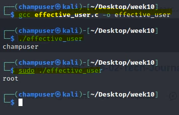
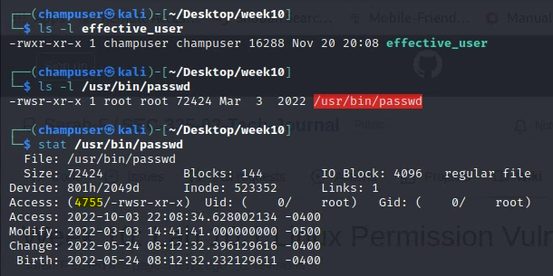
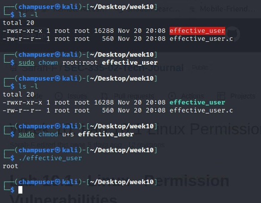
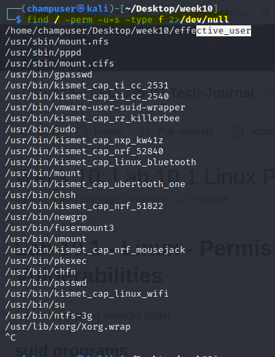

# Linux - Permission Vulnerabilities

| 💡The following 'C' program prints out the "effective user name" of the running process as opposed to the user who invoked that process. So if bob runs this program, bob would be printed out. If it is run as sudo, root would be printed out. If the suid bit is set, the owner of the file will be the effective user. So if root owns the file and bob runs it, the effective user will be root. |
| :----------------------------------------------------------: |

```c
#include <stdlib.h>
#include <pwd.h>
#include <stdio.h>
#include <unistd.h>

/*
SEC335 Illustrate SUID Programs
* based on: https://stackoverflow.com/questions/8953424/how-to-get-the-username-in-c-c-in-linux
* Make sure run the following
* sudo chown root:root nameofprogram
* sudo chmod u+s nameofprogram
*/

int main(int argc, char *argv[])
{
  struct passwd *pw;
  uid_t uid;
 
  uid = geteuid ();
  pw = getpwuid (uid);
  if (pw)
    {
      puts (pw->pw_name);
      exit (EXIT_SUCCESS);
    }
  else
  {
     puts ("Error");
     exit (EXIT_FAILURE);
  }
}

```

## Deliverable 1. Using the code above, create a file called effective_user.c and compile and execute the file as a normal user and using sudo. Provide a screenshot similar to the one below.




## Deliverable 2. What are the octal (numeric) permissions of the effective_user program? Using ls -l you should be able to calculate these permissions, you can also use the "stat" program as a shortcut. Remember r=4,w=2, x=1, and "-" is a 0!

Repeat the following use of ls -l and stat on the passwd program




| 💡The octal code is not intuitive. The /usr/bin/passwd program has the suid bit set which means that the program runs with the owner's permissions (root). This makes sense because when a normal user changes their password the /etc/passwd and /etc/shadow files must be changed. Note the leading 4 in the octal code. This indicates a suid executable (the 'x' is implied). |
| :----------------------------------------------------------: |

## Deliverable 3. Figure out how to change the ownership of your c program executable such that the file is owned by user: root and group: root. Once you've done that, add the suid bit to the program (this is shown in the screenshot) and execute the program as a normal user. Provide a screenshot similar to the one below:




## Deliverable 4. Hit the internet and find a means to search for suid programs across your kali system. Do so as a normal user as this is a privilege escalation technique you might use. Make sure to document this. You will need to deal with permissions errors by piping those to /dev/null. Provide a screenshot showing your command and listing similar to that below. Your own sudo program should be in the list.

* https://www.hackingarticles.in/linux-privilege-escalation-using-suid-binaries/
* https://steflan-security.com/linux-privilege-escalation-suid-binaries/
* https://dev.to/iggredible/what-does-2-1-mean-290





## Deliverable 5. A suid program has been hidden on rocky (10.0.17.200). Please hunt it down. Provide a screenshot that shows the command and file found. It will be obvious and the name will start with a 'b'.

rwx errors


`find / -perm -u=s -type f 2>/dev/null | grep /usr/bin/b`


## Deliverable 6. Consider the following screenshot. This user created a file under /etc/ that is world writable. Were this file to be of any security relevance, this could be a problem. Create such a file, and figure out how to find it. Show your command.

```
sudo nano /etc/happy_thanksgiving.txt 
sudo chmod o+w /etc/happy_thanksgiving.txt  
find /etc -perm -o=o -type f 2>/dev/null | grep hap
```


## Deliverable 7. A world writable file has been hidden on rocky. Please hunt it down. Provide a screenshot that shows the command and file found. It will start with an 's'. (note, the sys and proc directories will give you a lot of false positives)
```
ind / -not -path "/proc/*" -not -path "/sys/*" -type f -perm -o=w 2>/dev/null
cat /usr/share/games/solitaire
```


* https://linuxconfig.org/how-to-explicitly-exclude-directory-from-find-command-s-search
* https://www.crybit.com/exclude-directories/#:~:text=.%2Fcry%2Ffindme-,Method%201%20%3A%20Using%20the%20option%20%E2%80%9C%2Dprune%20%2Do%E2%80%9D,print%E2%80%9D%20switches%20with%20find%20command.&text=The%20directory%20%E2%80%9Cbit%E2%80%9D%20will%20be%20excluded%20from%20the%20find%20search!