# Lab 9.2 - Exploiting Gloin

Target: gloin.shire.org

## Deliverable 1. Provide the Following Information to include commands and screenshots. Create a tech journal page that covers the following.


* Target IP Address

  `sudo nslookup  gloin.shire.org 10.0.5.22`

  The Ip address is 10.0.5.31

  I used the nslookup tp figure out the ip address and I already knew the DNS.

  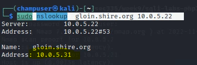

* Open Ports

  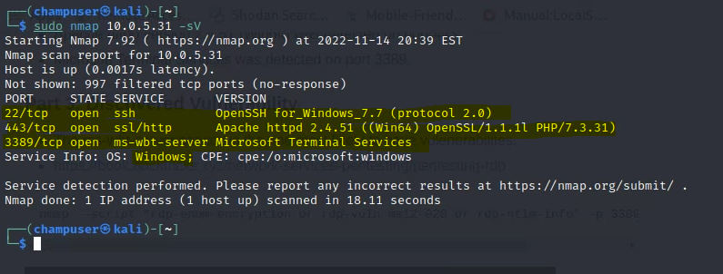

* Discovered Vulnerability

  I went to the following address https://10.0.5.31 and then I search for sql injection [https://stackoverflow.com/questions/53688134/what-is-the-meaning-of-admin-or-1-1]and I found I could use admin'or'1'=1 and I got in

  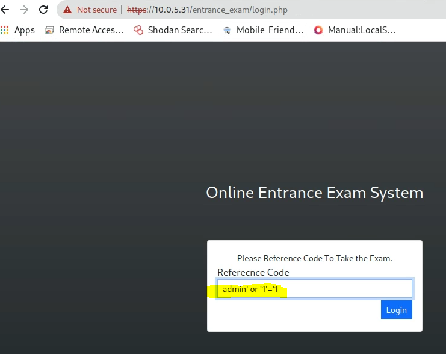

  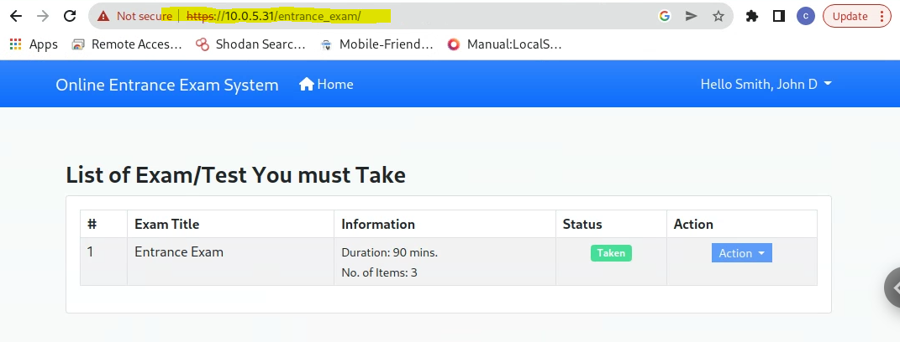

I ran `dirb https://10.0.5.31/entrance_exam -r /usr/share/wordlists/dirb/common.txt` to find the directories for the website:

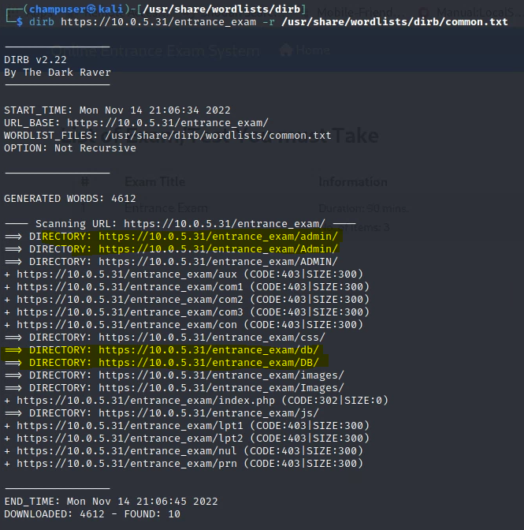

the once I think are important are:

```
https://10.0.5.31/entrance_exam/admin
https://10.0.5.31/entrance_exam/Admin
https://10.0.5.31/entrance_exam/db
https://10.0.5.31/entrance_exam/DB
```

I went to `https://10.0.5.31/entrance_exam/admin`

and then I used the same login before and then I was able to login:

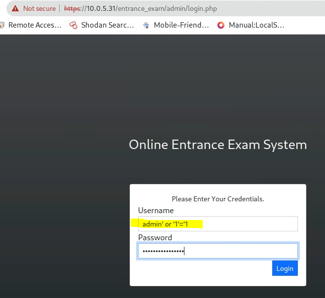

I went to `https://10.0.5.31/entrance_exam/db`

I found the 

and then I used the same login before and then I was able to login:

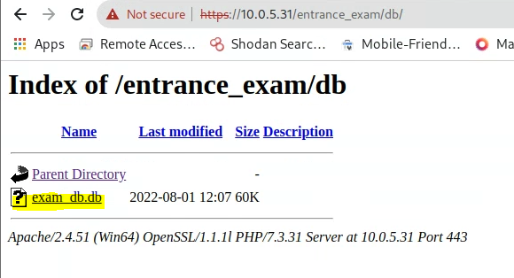

Inside the database I found the admin username and password but hash so we need to use a website to get the text of the hash:

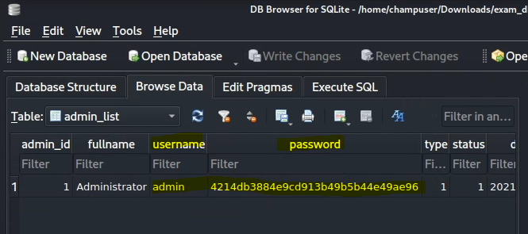


* How you achieved a foothold

  I used the following website [https://hashtoolkit.com/decrypt-hash/?hash=4214db3884e9cd913b49b5b44e49ae96] to decrypted it

  After finding the hash I decrypted and found it the password.

The password is `Moria2Featon6`


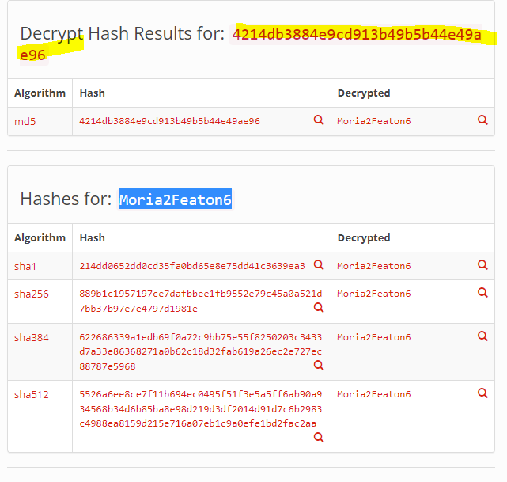

* How you achieved root/Administrative level compromise

  senice we have the User name and Password or an admin user, we can ssh to it:

  Username:Administrator

  password: Moria2Featon6

  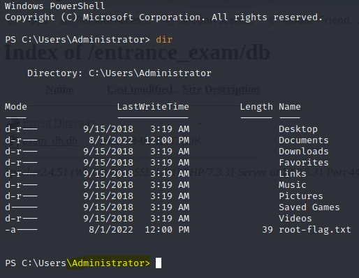

Or we can RDP to it using Remmina:

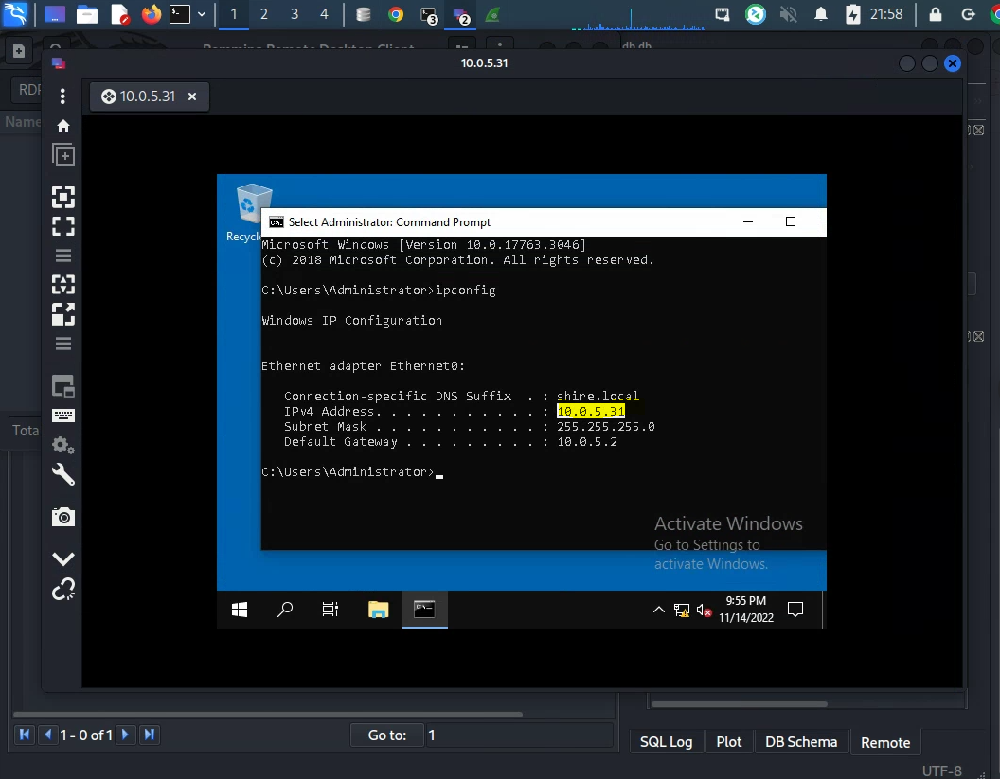

* 

* User Flag

  I went to C:\Users\gloin  and I found it

  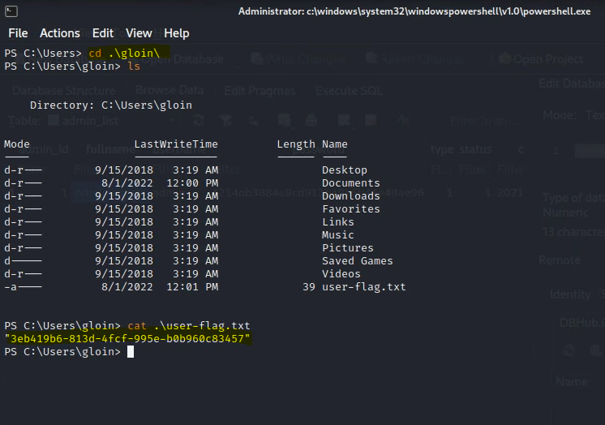

* Root Flag

  I used the following command to see what's inside the root flag:

  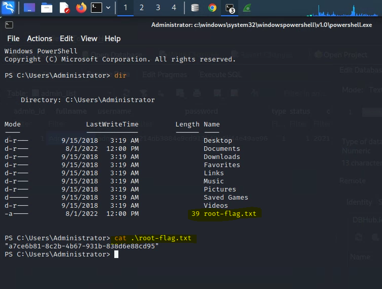

* How might the vulnerabilities be mitigated by the systems administrator and developer?

One thing I realized is that it was easy to find the database, by going to https://10.0.5.31/entrance_exam/db/ they should change the setting so that no one has access to it. there is a way to lock the database, I think that is the best way.

installing a security systems will be great and save, like Antivirus defender.

Using stranger password so it will hard to decrypt it. 


## Deliverable 2. Tech Journal Reflection.What gave you trouble with this Target? What did you need assistance with? Provide a link to your journal page.

one thing I gave me some trouble is that I forgot the tool to use to see the hidden directories in the website which was `dirb`

Other that that I liked it, it was fun.