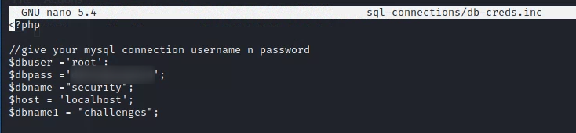
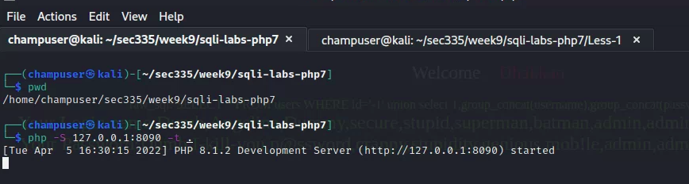
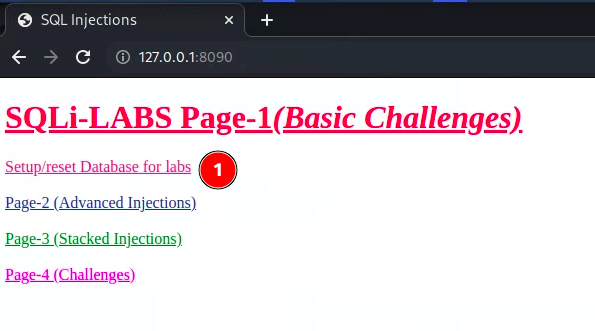

# Lab 9.1 SQLi Review

## Preparation

Mysqld configuration on Kali

```sh
sudo systemctl enable mysqld 
sudo systemctl start mysqld
sudo mysql_secure_installation
```

Note, current root password for mysql is nothing so hit [Enter]

```shell
Switch to unix_socket authentication [Y/n] n
Change the root password? [Y/n] Y
Remove anonymous users? 
Disallow root login remotely? [Y/n] y[Y/n] y
Remove test database and access to it? [Y/n] y
Reload privilege tables now? [Y/n] y
```

clone the sqli-labs-php git repository

```shell
mkdir -p ~/sec335/week9
cd ~/sec335/week9
git clone https://github.com/skyblueee/sqli-labs-php7.git
cd sqli-labs-php7
```

edit sql-connections/db-creds.inc



start the application


access the application and click on the Setup/reset Database for labs link.







Go through the following [SQLi walk through](https://dinohacks.blogspot.com/2019/09/audi-sqli-labs-lesson-1-walkthrough.html)Capture and label screenshots for:


